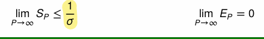
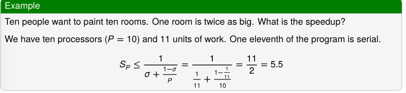
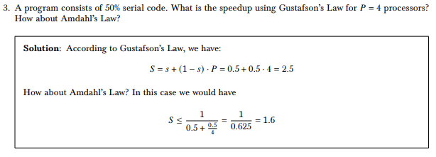
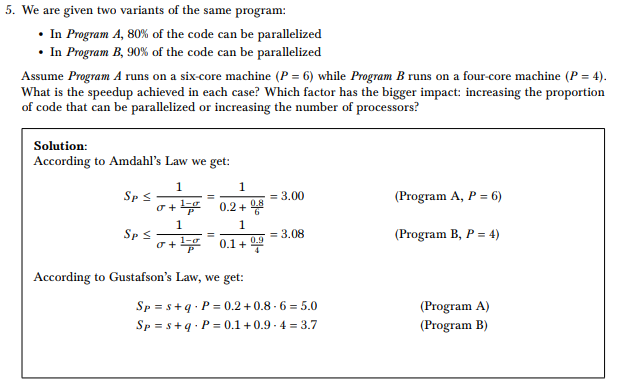
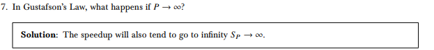

# VPS Klausur Vorjahr

## Table of Contents

1.  [Speedup und Effizients](#beschreibung-von-speedup-und-effizienz)
2.  [Amdahl und Gustavson](#speedup-und-effizienz-amdahl-und-gustavson)
3.  [Mutual Exclusion](#mutual-exclusion)
4.  [Mutex und Semaphore](#mutex-und-sempaphore)
5.  [Concurrency und Parallelism](#concurrency-and-parallelism)
6.  [Future, Promise, Continuation](#future-promise-continuation)
7.  [Asynchore Programmierung, Future, Promise, Continuation](#asynchrone-programmierung-future-promise-continuation)

## Beschreibung von Speedup und Effizienz

### Speedup

**T1..** Zeit mit einer CPU  
**TP..** Zeit mit mehreren CPUs

$S_p = \frac{T_1}{TP}$

Wie schnell ist ein paralleler Alogrithmus im vergleich zu einem sequentiellen.

### Effizienz

**SP..** Speedup  
**TP..** Anzahl der Prozessoren

$E_P = \frac{S_P}{P}$

Wie gut werden die verfügbaren Prozessoren genutzt.

## Speedup und Effizienz Amdahl und Gustavson

### Amdahl´s Law

Amdahls Law berechnet den theoretischen Speedup der be der Ausführung einer fixen Arbeitsbelastung erwartet werden kann, wenn die Anzahl der prozessoren erhöht wird.

- Annahme: Ein Teil der von einem seriellen Programm ausgeführt wird, ist parallelisierbar
- Anhanme: Unser Program lässt sich teilweise parallel implementieren
- Sei σ der Anteil von 𝑇1, der dem sequentiellen Code entspricht.

**Formeln:**

$$S_P \leq \frac{T_1}{T_P} = \frac{1}{\sigma + \frac{(1 - \sigma)}{P}} $$

$$E_P \leq \frac{S_P}{P} = \frac{1}{\sigma (P -1) + 1} $$



**Beispiel**




### Gustavson´s Law

Gustavson´s Law berechnet ebenfalls den theoretischen Speedup, aber mit einem mehr optimistischen (realistischen) Model.

1. Es gibt Programme de mehr Speedup erreichen wie Amdahl vorhersagt
2. Die Problemgröße wächst und Computer werden immer besser
3. Der Arbeit für den parallelen Teil wächst meist schneller als der serielle Teil.

**Zusammengefasst:** Wenn die Problemgröße wächst, der serielle Anteil schrumpft, wird der Speedup größer. Gustavson´s Law hällt, solange Punkt 3. zutrifft.

**Formeln:**

**s..** Anteil der seriellen Arbeit
**q..** Anteil der parallelen Arbeit
**P..** Anzahl der Prozessoren

$$S_P = s + q * P = 1 + (P - 1) * q $$


**Beispiel:**


## Mutual Exclusion

**= (Wechselseitger Ausschluss)**
Mindestens eine Ressource muss in einem nicht gemeinsam nutzbaren Modus gehalten werden, das heißt, nur ein Prozess kann die Ressource zu einem bestimmten Zeitpunkt nutzen.

- Höchstens ein Prozess der Code eines Kritischen Abschnitss ausführt, in dem er eine Sperre (Lock) erwirbt
- Egal wie der Prozess sie erworben hat, er wird eventuell terminieren
- Die Lösung des Mutual Exclusion Problems enstpricht der Imlementerung eines lock objects (Speerobjektes)

## Mutex und Sempaphore

### Mutex

Mutex = Synchronisationsmechanismus, der gegenseitigen Ausschluss beim Zugriff auf kritische Abschnitte gewährleistet.

**Eigenschaften:**

- Mutex hat zwei Hauptoperationen: acquire() (Speren), release() (Freigeben)
- Kann nur von dem Thread feigegeben werden der ihn auch gesperrt hat.
- Mutext kann gesperrt(locked) oder entsperrt(unlocked) sein
- Lock Counter gibt an wie oft der Mutex Rekursiv gespert wurde
- **Lock Rekursion vermeiden!!!!!!!**

**Verwendung:** Schutz vor Kritischen Abschnitten, wo nur ein Thread gleichzeitig Zuugiff haben darf

### Semaphore

Semaphore = Komplexerer Synchronisationsmechanismus, der auf einem Zähler basiert.

**Eigenschaften:**

- Startet mit einer initialen Anzahl von Tokens (Zählerstand)
- hat ebenfalls zwei Hauptoperationen
- acquire() verbraucht einen Token (Zähler --1)
- release() stellt wieder einen Token zu verfüfung (Zähler ++1)
- Wenn keine Tokens mehr zur verfügung stehen, müssen die Threads Warten.
- Kann von jedem Thrad freigeben werden,

**Verwendung** Typisch für die Begrenzung der Anzahl von gleichzeitigen Zugriffen auf eine Ressource

**Binäre Sempahore**

- Spezialfall
- Zähler kann nur wert 0 und 1 annehmen
- Ähnlich wie Mutex, kann aber von jedem Thread freigeben werden
- Ist die einfachste form einer Semaphore

## Concurrency and Parallelism

### Concurrency (Nebenläufigkeit)

Beschäftigt sich damit mehrere Dinge gleichzeitig zu behandel (Struktur)

- Beschreibt die Fährigkeit, mehrere Aufgaben gleichzeitig zu behandeln (virtuell parallel)
- Auführung verläuft verschachtelt, es ist immer nur ein Prozess aktiv
- Alles wird auf einer einzigen CPU ausgeführt
- Fokussiert sich auf die Struktur und Organisation des Programmes

**Ziel:** Programm in unabhängig voneinander ausführbare Teile zu zerlegen

### Paralellism (Parallelität)

Beschäftigt sichd damit mehre Dinge gleichzeitig auszuführen(Ausführung)

- Spezialfall der Concurrency
- Aufgaben werden tatsächlich gleichzeitig ausgeführt
- Benötigt mehrere CPUs
- Fokusiert sich auf die gleichzeitige Ausführung
- Physische parallel Ausführung von Prozessen

## Asynchrone Programmierung Future Promise Continuation

Das asynchrone Programmiermodell ermöglicht es, dass lang andauernde oder blockierende Aufgaben (wie z. B. Netzwerkanfragen) parallel ausgeführt werden, ohne die Ausführung des Hauptprogramms zu unterbrechen. Dies geschieht durch die Trennung von Initiierung und Abschluss einer Aufgabe.

Eine asynchrone Funktion startet die Arbeit in einem anderen Thread und gibt sofort ein Objekt zurück, das die asynchrone Operation repräsentiert - das sogenannte Future/Promise.

### Future/Promise

Ein Future/Promise ist ein Platzhalter für ein Ergebnis, das noch nicht bekannt ist, meist weil seine Berechnung noch nicht abgeschlossen ist. Es repräsentiert das Ergebnis eines asynchronen Aufrufs.

### Future/Promise in C#

In C# wird dies durch `async`, `await` und `Task` implementiert. Der Platzhalter Promise/Future, der das zukünftige Ergebnis darstellt, wird durch einen `Task` oder `Task<T>` repräsentiert.

```csharp
public async Task<string> GetDataAsync() {
    // long execution time
}
```

### Continuation

Eine Asynchore aufgare welche von einer vorangehenden Aufgabe aufgerufen wird, wenn diese fertig ist.

```csharp
 //waitforfivesecondsthenprintthe number 42
Task.Delay(5000).GetAwaiter().OnCompleted(()=> Console.WriteLin(42));

//or
Task.Delay(5000).ContinueWith(ant =>Console.WriteLine (42));
```

```csharp
primeNumberTask.ContinueWith(antecedent =>
{
    int result=antecedent.Result;
    Console.WriteLine(result);
});
```

**Die wichtigsten Konzepte sind:**

- `async` markiert eine Methode als asynchron
- `Task` (oder `Task<T>` für Methoden, die einen Wert zurückgeben) repräsentiert die asynchrone Operation und fungiert als Platzhalterobjekt (Future)
- `await` wird verwendet, um auf das Ergebnis einer asynchronen Methode zu warten, ohne den aktuellen Thread zu blockieren

### Verwendung von await in C#

Das `await`-Schlüsselwort hat folgende Eigenschaften:

- Es wird innerhalb einer asynchronen Methode verwendet, um auf den Abschluss einer anderen asynchronen Methode zu warten
- Wenn eine asynchrone Methode einen Await-Ausdruck oder eine Anweisung erreicht, wird die Methode angehalten, und die Kontrolle wird an den Aufrufer zurückgegeben
- Die Methode wird fortgesetzt, nachdem die erwartete asynchrone Methode abgeschlossen ist
- Wenn eine asynchrone Methode keinen Await-Ausdruck enthält, wird sie synchron ausgeführt (blockiert)

Hier ein Beispiel:

```csharp
// Während CallDependencyAsync() awaited wird,
// kann der Aufrufer von DoSomethingAsync() andere Aufgaben ausführen,
// da er die Kontrolle zurückerhält
public async Task<int> DoSomethingAsync() {
    var result = await CallDependencyAsync();
    return result + 1;
}
```

## Thread Save Unbouned Queue

```c#
class ProducerConsumerQueue :IDisposable {
  SemaphoreSlimsem = new SemaphoreSlim(0, int.MaxValue); //signal worker thread
  Thread worker;
  object locker = newobject(); //explicit sync object
  Queue<object> jobs = new Queue<object>();
  bool terminate = false; //signal termination

  publicProducerConsumerQueue() {
    worker= new Thread(Work);
    worker.IsBackground = true;
    worker.Start();
  }

  public void EnqueueJob(object job){
    lock (locker){ // Thread-safe job addition
      jobs.Enqueue(job); //add new job to the job queue
    }
    sem.Release();  //signal that new work is available -> Wake up Worker if blocked
  }

  public void Dispose(){
    terminate = true;
    signal.Release();
    worker.Join();  //terminate work
  }
  public void Work() {
    while (!terminate) {
      object job = null;
      lock(locker) {  // Thread-safe job retrieval
        if(jobs.Count > 0){
          job = jobs.Dequeue(); //get next job
        }
      }

      if(job != null){ //execute job or wait
        Console.WriteLine("Job"+job);
      }
      else {
        sem.Wait();   // No jobs available, wait for signal from EnqueueJob -> Blocked
        }
      }
   }
}
```

## Parallel.For

```csharp
// Sequential for
for(int i=0;i< n;++i){
  Process(i);
}

// Parallel For -> von 0 bis n
Parallel.For(0, n, i => {
  Process(i);
});

// Thread-local variables
Parallel.For   (fromInclusive, toExclusive, localInit, body, localFinally)
Parallel.For<T>(Int64,  Int64,  Func<T>,  Func<Int64, ParallelLoopState, T>,  Action<T>)

int[] nums = Enumerable.Range(0,1_000_000).ToArray();
longtotal = 0;

// Use type parameter to make subtotal a long, not an int
var result = Parallel.For<long>(
      0,                    // fromInclusive
      nums.Length,          // toExclusive
      () =>0,               // localInit
      (j, loop, subtotal) => // subtotal isthread-local
        { // this is the loop body
          subtotal += nums[j];
          returnsubtotal;
        },
      subtotal => Interlocked.Add(ref total,subtotal)); // localFinally


```

## Parallel.ForEach

```csharp
// Sequential foreach
foreach(varitem in sourceCollection){
  Process(item);
}

// Parallel ForEach -> über IEnumberable
Parallel.ForEach(sourceCollection, item => {
  Process(item);
});

// Partition-local variables
Parallel.ForEach   (sourceCollection, localInit, body, localFinally)
Parallel.ForEach<T>(IEnumerable<T>,  Func<T>,  Func<Int64, ParallelLoopState, T>, Action<T>)

int[] nums = Enumerable.Range(0,1_000_000).ToArray();
longtotal = 0;

// <type of source elements,  type of thread-local variable>
var result = Parallel.ForEach<int, long>(
      nums,     // sourceCollection
      () => 0,  // localInit
      (j, loop, subtotal)=> // subtotal is thread-local
        { //  this is the loop body
          subtotal += j;
          return subtotal;
        },
      //  finalResult is a partition-local variable
      (finalResult)=> Interlocked.Add(ref total,finalResult)); // localFinally
```

## Partitioner

```csharp
double[] values = ...;
double sum = 0; // Declare the sum variable
object locker = new object();
var rangePartitioner = Partitioner.Create(0, values.Length);

Parallel.ForEach(
      rangePartitioner, // Range to aggregate
      () => 0.0,        // Initial partial result
      (range, state, initialValue) =>
        { // Loop body for each range
          double partialResult = initialValue;
          for (int i = range.Item1; i < range.Item2; ++i) {
              partialResult += Normalize(values[i]);
          }
          return partialResult;
        },
      (partialResult) => { // Compute final result
          lock (locker) {
              sum += partialResult; // Write to the shared sum variable
          }
      }
);
```
